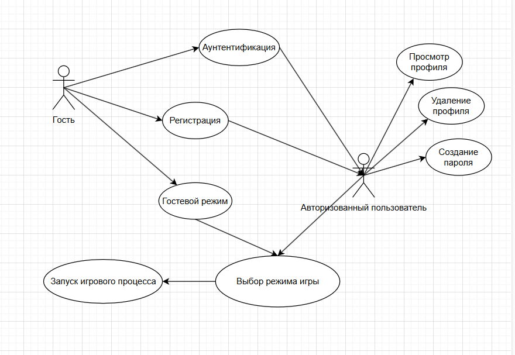

# 2-D-Billiard-game
Разрабатываемая игра "Бильярд" является 2D аркадной игрой, позволяющей пользователям играть в бильярд на одном компютере в доступные режимы "Пул" и "Русский бильярд"

Выполнил Специан Макар Вадимович, гр. 353504

### Функциональная модель игры

Пользователям доступны роли «Гость» (пользователь, не зарегистрированный в системе) и «Авторизованный пользователь». Функционал, представленный для каждой роли, обозначен ниже.

Гость — это пользователь, не зарегистрированный в системе. Доступные функции:

* Вход в гостевой режим: Возможность начать игру без регистрации.
* Регистрация: Заполнение формы с указанием данных для создания профиля.
* Аутентификация: Вход в систему для авторизованных пользователей.

Авторизованный пользователь - гость, прошедший регистрацию или аутентификацию. Доступные функции:

* Просмотр профиля: Доступ к отображению имени, количества побед и других данных.
* Удаление профиля: Пользователь может удалить своё профиль.
* Создание пароля: Защита своего профиля и дальнейший доступ по паролю.
* Имя игрока: Отображение имени в игре, основанное на выбранном профиле.

После входа в систему или использования гостевого режима, игроки выбирают режим, в котором они хотят сыграть. После выбора режима начинается игровой процесс, где пользователи могут взаимодействовать с игровым полем. Система отслеживает результаты матчей и обновляет статистику пользователей.

### Функциональные требования 

Функция запуска игрового процесса:
- Пользователь инициирует запуск игры
- Инициализация игрового поля
- Работа логики игры в зависимости от выбранного режима
- Физика шаров и ударов

Функция регистрации пользователя:
- Пользователь инициирует процесс регистрации.
- Для завершения процесса необходимо ввести логин и пароль.
- При некорректных данных пользователь получает сообщение об ошибке. Предоставляется возможность исправить данные и
  повторить попытку.
- После успешной регистрации пользователь может изменить пароль.
- Профиль храниться в файлах игры

Функция аунтентификации:
- Пользователь инициирует процесс аунтентификации.
- Для завершения необходимо ввести корректные логин и пароль.
- При некорректном вводе данных пользователь получает сообщение об ошибке. Предоставляется возможность повторить попытку.

